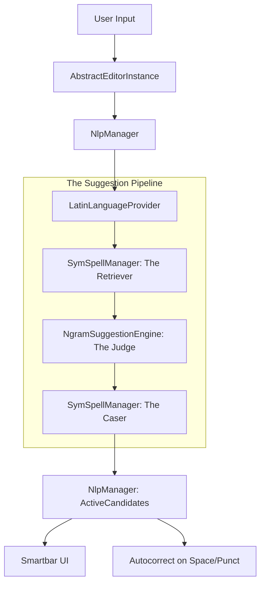

# OmniBoard Autocorrect & Suggestion Flow

This document maps the complete technical pipeline from user input (keystrokes) to displayed suggestions and automatic corrections.

## 1. High-Level Architecture

The system follows a **"Brain Transplant"** architecture where candidate retrieval is separated from ranking and casing.

---

## 2. Initialization Flow

Components initialize asynchronously during app startup or subtype switching.

1.  **FlorisImeService**: Starts the IME.
2.  **NlpManager.preload(subtype)**: Triggered when a language subtype is activated.
3.  **SymSpellManager.init()**:
    *   Loads `unified_dictionary.tsv` (unigrams) into SymSpell.
    *   Loads `final_mobile_bigrams.tsv` (bigrams) into SymSpell.
    *   **BigramTable.load()**: Loads shared bigram data (singleton used by both engines).
    *   **buildPrefixIndex()**: Builds a 1-3 character prefix map for fast autocomplete.
    *   Sets `isReady = true`.
4.  **LatinLanguageProvider.preload()**:
    *   **NgramSuggestionEngine.fromStreams()**: Loads unigram frequencies from `unified_dictionary.tsv` into memory for log-frequency scoring.

---

## 3. Main Suggestion Pipeline (Step-by-Step)

The flow begins at `LatinLanguageProvider.suggest()`.

### Step 1: Early Returns & Shortcuts
*   **Empty Input**: Returns next-word predictions via `BigramTable`.
*   **Lone "i"**: Force-corrects to "I".
*   **Contractions**: Checks `CasingUtils.CONTRACTION_SHORTCUTS` (e.g., `dont` -> `don't`) before running the engine.

### Step 2: Candidate Retrieval (The Retriever)
`LatinLanguageProvider` calls two retrieval methods in `SymSpellManager`:
1.  **findPrefixCandidates()**: Lookups in `prefixIndex`. Returns words starting with the typed prefix (Autocomplete).
2.  **findCandidates()**: Performs a `symSpell.lookup` with `Verbosity.All` and `MAX_EDIT_DISTANCE = 2` (Typo Correction).
*   **Merging**: Candidates are merged and deduplicated by term.

### Step 3: Candidate Ranking (The Judge)
`LatinLanguageProvider` calls `ngramEngine.rank()`:
1.  Calls **CandidateScorer.score()** for each candidate.
2.  **Scoring Factors (Lower is Better)**:
    *   **Edit Distance**: Base penalty.
    *   **Spatial Cost**: Penalizes far keys, rewards transpositions.
    *   **Bigram Bonus**: Subtracts weight based on `BigramTable` strength.
    *   **Apostrophe Bonus**: Rewards exact letter matches like `im` -> `I'm`.
    *   **Exact Match Bonus**: Strong reward if the typed word is a valid dictionary entry.
    *   **User Dictionary Bonus**: Massive reward for personal words.
    *   **Anti-Corrections**: Returns `CULLED_SCORE` (Double.MAX_VALUE) for forbidden pairs.
    *   **Grammar Blocking**: Culls contractions preceded by possessives (e.g., "my I'd").
3.  **Confidence Conversion**: Converts penalty to confidence (`-penalty`) and sorts descending.

### Step 4: Casing & Filtering (The Caser)
`LatinLanguageProvider` processes the ranked list:
1.  **applyPredictedCasing()**: Uses `CasingUtils` to match original input casing (Sentence start, AllCaps, etc.).
2.  **Valid Word Immunity**: If the user typed a valid word, the engine is extremely conservative about auto-correcting it.
3.  **Auto-Commit Logic**:
    *   `shouldCommit = isChange && (!isInputValidWord || isCasingFix)`
    *   This means we only autocorrect typos, not valid words (unless it's just a casing fix like `monday` -> `Monday`).

### Step 5: Final Assembly
*   The raw typed word is prepended to the list (iOS/Gboard style).
*   Resulting list sent to `NlpManager` -> `activeCandidates`.

---

## 4. Critical Variables & State

| Variable | Location | Role |
| :--- | :--- | :--- |
| `isReady` | `SymSpellManager` | `true` only if dictionary loaded successfully. |
| `ngramEngine` | `LatinLanguageProvider` | Null if unigram loading failed. |
| `prefixIndex` | `SymSpellManager` | Map of `prefix -> words`. If empty, autocomplete fails. |
| `BigramTable` | `BigramTable` | Singleton. If null, context-aware scoring is disabled. |

---

## 5. Known Issues: "Zero Suggestions" Bug

**Symptom**: Typing "wouldf" results in no suggestions appearing in the Smartbar.

### Potential Breakpoints:
1.  **Dictionary Load Failure**: `SymSpellManager.isReady` is `false`. Check logcat for `Reflexes Failed to Load Dictionary`.
2.  **NgramEngine Load Failure**: `ngramEngine` is `null`. Pipeline falls back to old `suggest()` logic which might be less robust.
3.  **Culling Overkill**: `CandidateScorer` might be returning `CULLED_SCORE` for valid corrections due to a logic bug in Anti-corrections or Grammar blocking.
4.  **Two-Letter Filter**: If the word is interpreted as 2 letters, it might be filtered by the `TWO_LETTER_WHITELIST`.
5.  **Trim Logic**: `LatinLanguageProvider` uses `.trim()`. If the editor provides leading whitespace incorrectly, it might mangle the lookup.

---

## 6. File Reference Map

| Component | File | Key Functions |
| :--- | :--- | :--- |
| **Orchestrator** | `LatinLanguageProvider.kt` | `suggest()` (Line 144) |
| **Retriever** | `SymSpellManager.kt` | `findCandidates()` (Line 503), `findPrefixCandidates()` (Line 615) |
| **Judge** | `SuggestionEngine.kt` | `NgramSuggestionEngine.rank()` (Line 105) |
| **Scorer** | `CandidateScorer.kt` | `score()` (Line 58) |
| **Caser** | `CasingUtils.kt` | `applyPredictedCasing()` (Line 50) |
| **Trigger** | `AbstractEditorInstance.kt` | `commitTextInternal()` (Line 360) |

---

## 7. Debugging Checklist

- [ ] Is `NlpStatus.isSymSpellReady` true? (Check via Debug Settings/Overlay).
- [ ] Is `NlpStatus.ngramUnigramCount` > 0?
- [ ] Does `SymSpellManager.findCandidates("wouldf")` return any results in a unit test?
- [ ] Are candidates being rejected by `PersonalPreferences.isAntiCorrection`?
- [ ] Is the `prevWord` being correctly identified? (Check `getPreviousWord` in `NlpManager`).
- [ ] Check `Logcat` for "CULLED" messages from `CandidateScorer`.
