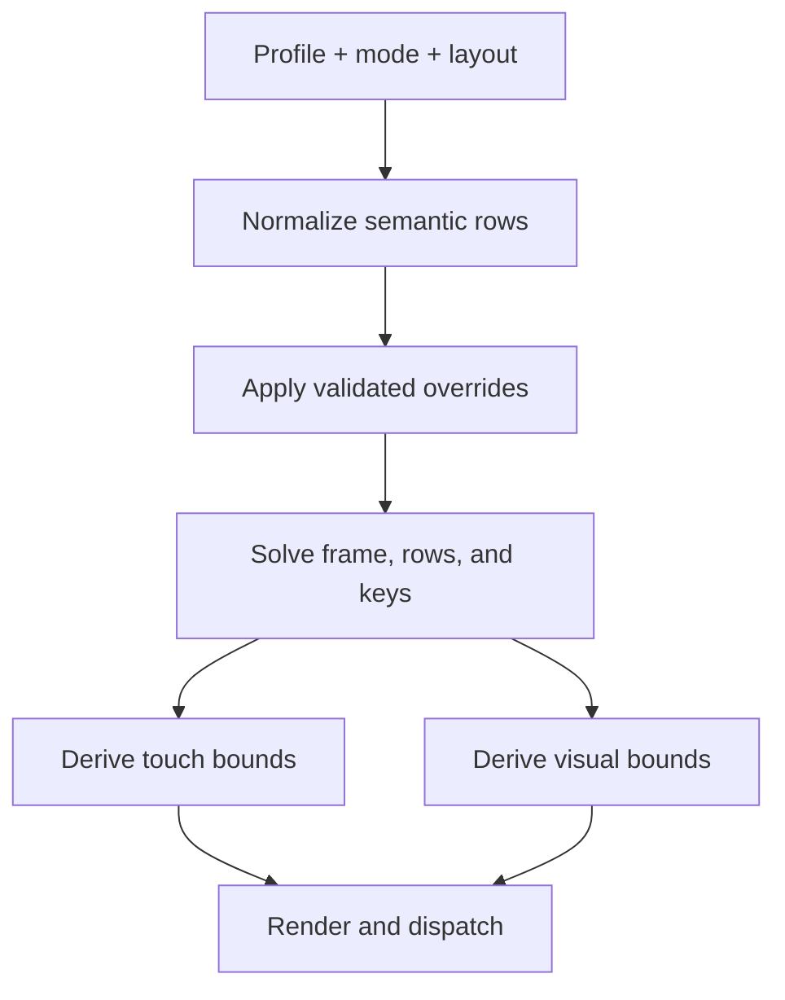

# OmniBoard Row and Geometry Architecture

Status: Approved target architecture  
Repository baseline: `yourowndog/keyboard` at `805d3e58e947215a9eb88ab9ed92b46366c54ef0`  
Evidence source: `Phase_C_OmniBoard_Repository_Reconciliation.md` (2026-07-26)

## Purpose

This document defines the authoritative end state for OmniBoard keyboard profiles, semantic rows, responsive layout, and geometry customization.

It is intentionally independent of the historical FlorisBoard implementation. Current code determines migration hazards, not the target model.

## Product model

OmniBoard has two first-class user experiences:

- **Text** — a compact, familiar everyday keyboard.
- **Coding** — OmniBoard's expanded keyboard with a primary action row and dedicated coding utility workspace.

A profile is not a keyboard mode, subtype, or layout pack:

- A **profile** selects an experience and its geometry/customization state.
- A **layout** describes an ordered arrangement of semantic rows and keys.
- A **subtype** continues to represent language and component selection.
- A **mode** represents temporary input surfaces such as characters, symbols, numeric, or phone.
- A **layout pack** is a serialized user-authored layout definition.

These concepts may reference one another but must not be collapsed into one identifier.

## Required separation of concerns

Every normalized row carries four independent kinds of information:

| Concern | Question answered | Example |
|---|---|---|
| Semantic identity | What is this row? | `PRIMARY_ACTION` |
| Stable identity | Which durable row instance is this? | `primary_action` |
| Provenance | Where did it come from? | bundled modifier asset, source row 0 |
| Behavioral policy | How may this row behave? | primary height group, dedicated boundary gaps |

Solved geometry is a fifth concept. It is runtime output, never row identity.

## Semantic row model

The initial role vocabulary must honestly represent all current surfaces:

- `ALPHA` — letter-entry rows.
- `PRIMARY_ACTION` — the main Space/punctuation/action row.
- `CODING_UTILITY` — coding navigation, modifiers, arrows, Escape, and related controls.
- `EXTENSION` — explicitly inserted extension rows.
- `NUMERIC` — numeric-entry rows.
- `SYMBOL` — symbol-entry rows.
- `PLACEHOLDER` — loading-only rows that are not persisted or customizable.

Empty sentinel keyboards carry no rows and are explicitly exempt from layout semantics.

Roles are not geometry aliases. A numeric row does not become `ALPHA` to receive ordinary sizing. A primary action row does not become `CODING_UTILITY` because its asset came from a historically named modifier layout.

New roles require a demonstrated semantic distinction. Geometry differences alone belong in policy.

## Normalized runtime model

The runtime boundary after loading/composition must be equivalent to:

```text
NormalizedKeyboard
  profileId
  layoutId
  mode
  orderedRows[]
    stableRowId
    semanticRole
    provenance
    orderedItems[]
      key | spacer
    geometryPolicyRef
```

Required invariants:

1. Normal composition and layout-pack composition produce the same normalized contract.
2. Semantic row identity survives until rendering, hit testing, popup placement, and customization.
3. Downstream code must not infer row identity from row index, row count, key contents, `isAlpha`, or source filename.
4. Stable IDs describe durable meaning, not array positions such as `main:2`.
5. Provenance remains available for diagnostics and migration but never controls behavior implicitly.

## Layout representation

A row is an ordered sequence of keys and explicit spacers. It may also define leading and trailing margins.

Widths are proportional units, not absolute coordinates. The solver converts units into device-specific rectangles.

Example:

```text
Tab 1.2 | spacer 0.25 | comma 0.8 | Space 4.0 | period 0.8 | Enter 1.4
```

This model supports asymmetric layouts while retaining four guarantees:

- all structural rectangles fit the available width;
- structural rectangles never overlap;
- neighboring items reflow when a structural width changes;
- invalid minimum sizes or impossible unit combinations fail validation rather than rendering corrupt geometry.

Arbitrary free-positioned rectangles are not the primary editing model.

## One authoritative geometry process

The pipeline is:



The same immutable solved result governs:

- total keyboard content height;
- row allocation and vertical boundaries;
- key structural allocation;
- touch bounds;
- visual bounds;
- popup geometry inputs.

Outer frame sizing and internal layout must not recalculate geometry independently.

## Geometry layers

| Layer | Ownership |
|---|---|
| Structural allocation | Non-overlapping land assigned to rows, keys, and spacers |
| Touch bounds | Pressable regions derived from structural allocation under explicit edge rules |
| Visual bounds | Painted keycaps and insets derived from structural allocation |

A preference or editor control must declare which layer it changes.

- Structural key width changes cause row reflow.
- Visual padding may change appearance without changing touch or allocation.
- Touch expansion may extend into a controlled gap or screen edge but cannot silently redefine visual layout.

## Vertical boundaries

Gaps are relationships between semantic rows or between a row and the keyboard edge.

The solver must be able to represent at least:

- `ALPHA -> PRIMARY_ACTION`
- `PRIMARY_ACTION -> CODING_UTILITY`
- `CODING_UTILITY -> CODING_UTILITY`
- final row -> bottom edge

User-facing controls may group several boundaries, but the stored/runtime model must not encode them as “row N-2” or “the last two rows.”

The bottom system/window offset is outside solved row geometry. It remains a device/window-layer concern.

## Frame policies

Stable height across temporary mode changes is supported as an explicit profile policy.

- Characters, Symbols, and Numeric-Advanced may share a profile frame policy.
- The implementation must not obtain this stability by borrowing a cached Characters keyboard and rerunning unrelated formulas.
- Numeric and Phone surfaces use their own declared mode policy unless explicitly grouped.

Frame policy determines which semantic layout establishes target height. The common solver still produces the result.

## Profile state and migration

Initial persistence rules:

- `activeProfileId` is a global persisted selection.
- Existing geometry, visibility, and customization values migrate to the Coding profile because those values were tuned against the Coding keyboard.
- Text receives clean profile defaults.
- Geometry values, row visibility, number/developer-row visibility, and structural customization are profile- or layout-scoped.
- Device/window concerns such as bottom offset remain shared.
- Existing subtype IDs and component mappings remain intact.
- Compact Coding (`modRowsVisible=false`) remains Coding with utility rows hidden. It does not become Text.

The first safe profile selector may live in settings. An on-keyboard switch can be designed separately without coupling it to the geometry foundation.

## Layout-pack contract

Layout packs must eventually serialize:

- schema version;
- stable profile/layout identity;
- semantic row identity and role;
- ordered keys and spacers;
- structural width units;
- validated optional policy/override references.

Older packs remain readable through an explicit compatibility decoder. Missing roles must not silently default all rows to alpha or invent two modifier rows.

Unknown semantic fields must not be silently discarded when doing so would change behavior.

## Frontend editing contract

Backend/source layout creation owns:

- row addition/removal;
- stable row identity;
- semantic roles;
- key actions;
- default units, margins, and spacers;
- exposed customization capabilities.

Frontend tweaking owns validated overrides such as:

- row height;
- row-boundary spacing;
- horizontal key spacing;
- structural key width units;
- leading/trailing row margins;
- optional row visibility;
- visual insets.

The frontend edits normalized parameters, then requests a new solved result. It never patches finished rectangles as a substitute for structural reflow.

## Non-negotiable invariants

1. No downstream row-position or key-content inference.
2. No numeric or symbol row masquerading as alpha.
3. No primary action row masquerading as coding utility.
4. No structural overlap.
5. No independent outer-height and inner-row formulas.
6. No post-layout structural gap mutation.
7. No structural width edit that leaves neighbors stationary.
8. Touch, visual, and structural geometry remain inspectable separately.
9. All five current `TextKeyboard` construction sites receive an explicit contract.
10. Geometry/profile changes participate in observable state and recomputation.
11. Popup sizing and anchoring consume declared solved/visual inputs.
12. Migration preserves subtype data and existing Coding tuning.

## Explicit non-goals for the foundation migration

- A new key-binding system.
- Arbitrary drag-anywhere rectangles.
- Broad FlorisBoard asset pruning.
- Reusing the dead QWERTY row as the Text profile.
- Redesigning autocorrect or suggestion behavior.
- Choosing a permanent on-keyboard profile-switch gesture.

